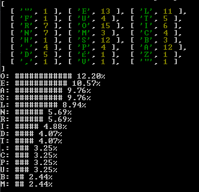

# Programa Histograma.

Este programa lee un texto de entrada estándar, calcula la frecuencia con que se repite cada carácter ("Letra") del texto y muestra un histograma de los caracteres de uso frecuente. Se utilizará node para la ejecución. 
```  
node app.js < mensaje.txt
```
**Resultado de la ejecución**
<br />


## Autor 
- Raul Alzate 
